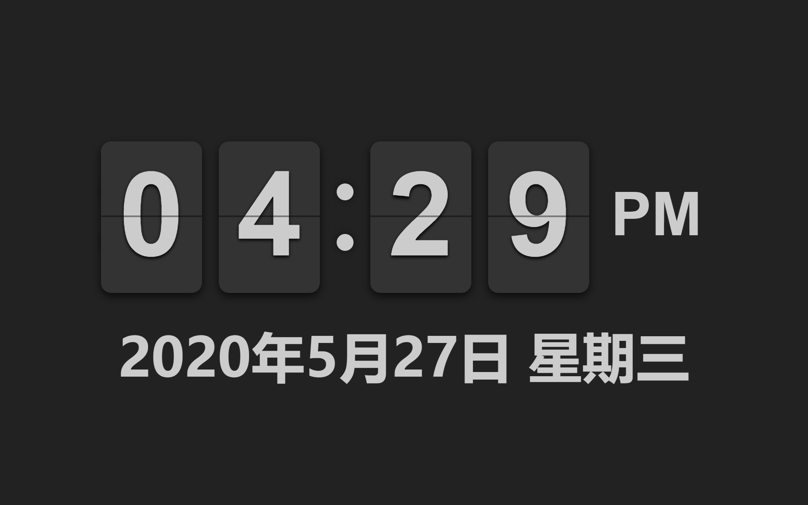
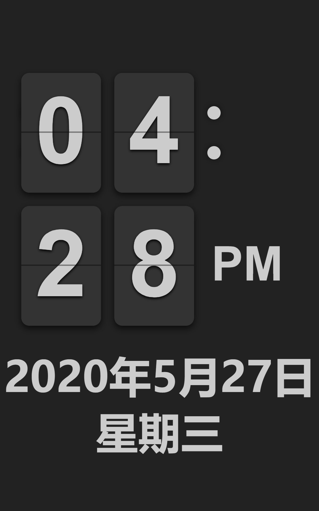

# Flip Clock Webpage

**link:** [clock.nicejob.xyz](http://clock.nicejob.xyz/)

## Introduction

A webpage that include a beautiful flip clock and year-month-day + week.

It's just a good clock when you have two screen and the small one display the webpage (with F11).

    

    

## Reference

main copy from FlipClock@objectivehtml: [https://github.com/objectivehtml/FlipClock](https://github.com/objectivehtml/FlipClock)

style copy from [https://www.bilibili.com/s/video/BV14J411M7n3](https://www.bilibili.com/s/video/BV14J411M7n3)

date copy from [https://blog.csdn.net/Arthur0088/article/details/5096191](https://blog.csdn.net/Arthur0088/article/details/5096191)

time and date vertical center copy from 李天昭: [https://www.zhihu.com/question/20543196](https://www.zhihu.com/question/20543196)

4 x zoom learn+copy from

1. [https://www.jb51.net/article/122319.htm](https://www.jb51.net/article/122319.htm)
2. [https://blog.csdn.net/u014625500/article/details/27326647?utm_medium=distribute.pc_relevant.none-task-blog-baidujs-2](https://blog.csdn.net/u014625500/article/details/27326647?utm_medium=distribute.pc_relevant.none-task-blog-baidujs-2)
3. [https://blog.csdn.net/wxl1555/article/details/75051972](https://blog.csdn.net/wxl1555/article/details/75051972)
